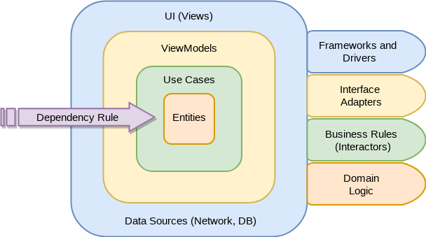

# Take Home Task

Hi there, this is my submission of the task.

For this application I have decided to code using Clean Architecture. With less dependency on the framework (Android).

## The App

## Architecture

I have used Clean Architecture for this application. My feature set are located inside the `feature` folder inside the app module. the core of the application is also defined inside the `core` package.

### Key Modules:

1. `common:platform`

   An Abstraction Layer Over Android's Fragments and Activities, ViewModels and Connectivity Broadcast receiver, with helpful extentions.

2. `common:reactive`

   An Abstraction on Reactive Use Cases and Executors

3. `app`

   The Application features. and the implementations of the previous abstractions. with 2 main submodules `feature` and `core`, the core handles implements the abstractions and the feature implement the individual feature.

### Feature:

For Any Given Feature we have 5 main folders:

1. Presentation: Contains the ViewModel and Fragments (UI)
2. Domain: Contains the Use Cases
3. Data: Contains the Repo
4. Network: Contains the Feature's Network Functions
5. Data Sources: Contains contracts between repository and data sources.

